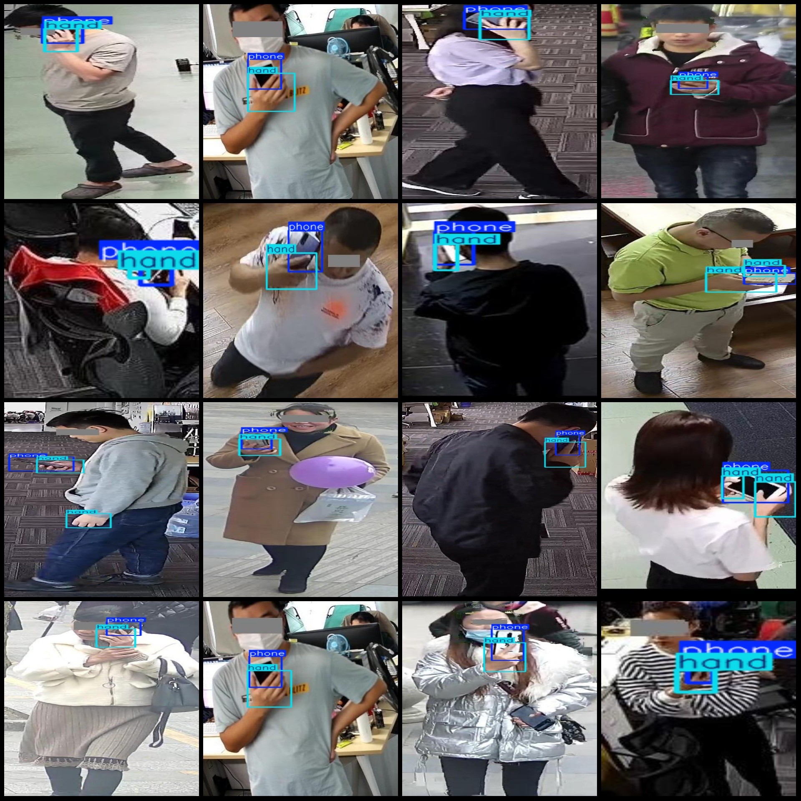
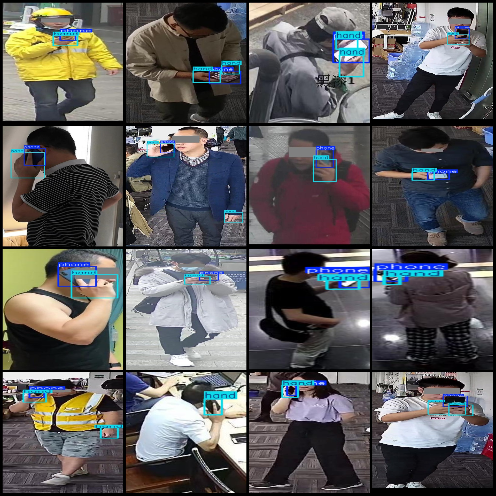

# Mobile Phone and Hand Detection Dataset (VOC+YOLO)

This dataset consists of 2332 images with a Pascal VOC format + YOLO format, divided into 2 categories. The dataset contains some enhanced images, and the faces in the images are all occluded.

The dataset is in the following format:
- Pascal VOC format xml files (without split paths)
- JPG image files
- Corresponding VOC format xml files
- YOLO format txt files

The number of images (JPG file count): 2332
The number of annotations (xml file count): 2332
The number of annotations (txt file count): 2332
The number of annotation categories: 2
The annotation categories names according to the labels folder "classes.txt": ["hand", "phone"]

Each category annotated boxes:
- Hand (hand) box count = 3573
- Phone (phone) box count = 2772
Total boxes = 6345

Image resolutions include multi-resolution images, such as 146x304, 109x303, etc.

The data labeling tool used is labelImg.
Annotation rules are to draw bounding boxes for each category.

Important note: The dataset does not have been divided into training, validation, or test sets, so you need to do it yourself.
Special declaration: This dataset does not guarantee the accuracy of the trained models or weight files.

Image preview:

Annotation example:

## Images

Here is a pay link on Stripe ( https://buy.stripe.com/3cs8yP7sY87d0vu9AB ). Please contact me lonlonago@foxmail.com after funding $89, and I will send you a complete data files , thank you!

